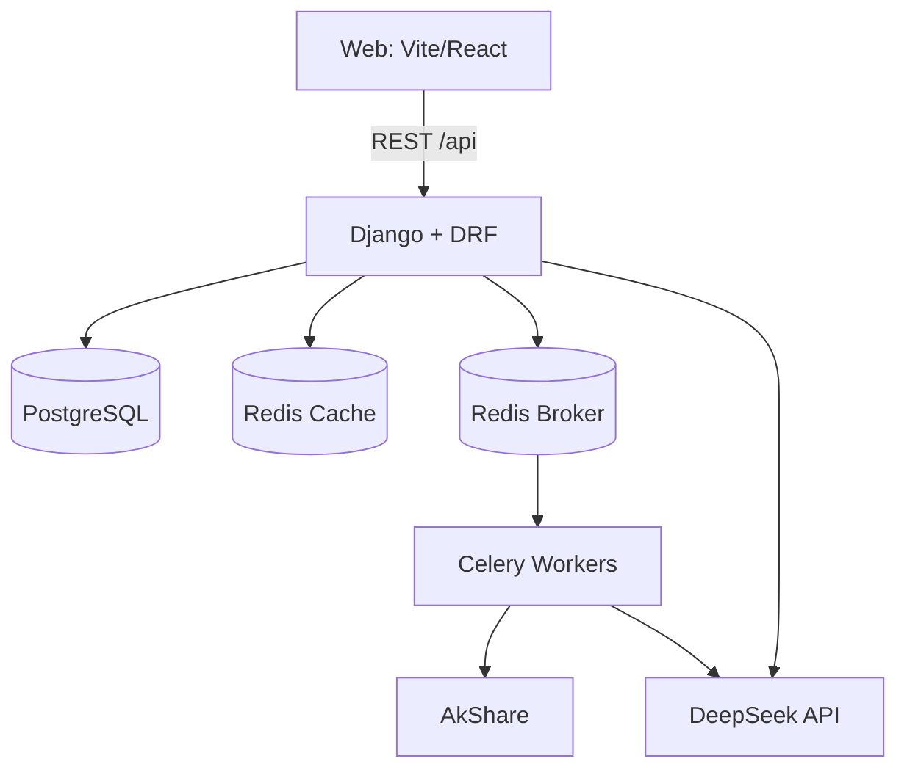

# Technical Design Document: FiAi Web MVP（A股 AI 投研 + 策略回测 + 模拟盘）

## 0. 范围与边界

- 目标：实现 Web MVP 闭环“选股 → 盯盘 → 复盘 → 策略验证/回测 → 规则生成（用于模拟盘）”，并为后续强化回测与模拟盘/实盘扩展留出清晰抽象层。
- 产品定位：研究与决策支持 + 可配置策略 + 回测/模拟盘验证；不提供具体个股“买/卖”投资建议，不承诺盈利。
- 合规边界：公告/研报/新闻抓取需来源白名单与许可标记；许可不明默认不抓全文，仅存链接与元信息。
- 风控硬约束：`Max Drawdown <= 25%` 作为“规则可启用到模拟盘”的门槛，且回测与模拟盘必须同口径可验证。

## 1. 现状基线（已存在工程）

### 1.1 前端（`E:\01_Project\FiAi\fronted`）

- 技术栈：`Vite + React + TS + antd + echarts + zustand + react-router-dom + axios`（见 `fronted/package.json`）
- 路由：`fronted/src/App.tsx` 使用 `react-router-dom` + `AuthGuard`（token 来自 `zustand`）
- API 客户端：`fronted/src/api/index.ts`
  - `axios` `baseURL: '/api/'`
  - request interceptor：从 `localStorage.token` 注入 `Authorization: Bearer ...`
  - 已封装：登录/注册、市场概览、自选分组、自选列表、AI chat/analyze
- 现有页面：`Dashboard`, `StockPage`, `AnalysisHistory`, `Settings`, `Login`, `Register`
- 现有组件：`StockChart`, `StockList`, `AIChat`

### 1.2 后端（`E:\01_Project\FiAi\backend`）

- 技术栈：`Django 5 + DRF + simplejwt + akshare + pandas + psycopg2-binary`（见 `backend/requirements.txt`）
- Django app：`backend/api`
- 现有模型：`backend/api/models.py`
  - `UserProfile`：存 DeepSeek 配置（key/provider/base_url/model）
  - `WatchlistGroup`、`Watchlist`
  - `AIAnalysisLog`
- 现有接口：`backend/api/urls.py`
  - Auth：`/api/token/`、`/api/token/refresh/`、`/api/register/`
  - 市场与标的：`/api/stock/`、`/api/market/index/`、`/api/market/top-gainers/`、`/api/market/top-industries/`
  - 自选：`/api/watchlist-groups/`、`/api/watchlist/`、`/api/watchlist/count/`
  - AI：`/api/ai/analyze/`、`/api/ai/chat/`

## 2. MVP 目标架构（单体分层 + 异步任务）

### 2.1 总体架构

### 2.2 设计原则（MVP 即固化）

- 可复现：回测/模拟盘运行必须保存配置快照（策略版本、参数、数据窗口、成本模型、撮合规则、风控阈值）。
- 可审计：事件文本与结构化抽取必须保留来源、许可、证据片段、解析版本；信号必须能追溯到触发阈值与证据引用。
- 反前视：回测与模拟盘用 `market_effective_time` 驱动触发，配合 `lookahead_guard`，禁止未来信息泄漏。
- 同口径：撮合、费用、风控为共享引擎；回测与模拟盘只切换“数据输入与时间推进方式”，不复制实现。

## 3. 后端模块边界（建议在单体内拆分 app）

MVP 先保持单体部署，但按领域分层拆 app，便于后续拆分：

- `api`：现有前端聚合接口与兼容层（尽量不破坏当前前端调用）
- `market_data`：行情统一读取与缓存（提供 bars、instrument、calendar）
- `data_ingestion`：AkShare 拉取、清洗、幂等 upsert、质量标记、增量更新
- `event_engine`：事件元信息入库、去重、实体链接、`market_effective_time` 对齐
- `feature_engine`：指标与特征计算（可缓存/可回放）
- `strategy_engine`：策略模板、参数 schema 校验、信号生成（研究信号）
- `risk_engine`：风控（单票/行业/组合）与“启用门槛”判定
- `backtest_engine`：L1 回测（撮合/成本/风控/报告）
- `paper_trading`：模拟盘（账户/订单/成交/回放）
- `audit`：策略版本/解析版本/数据版本/运行记录（便于复盘与排障）

## 4. 数据层设计（行情 + 事件）

### 4.1 数据库选择与索引

- MVP 推荐：`PostgreSQL`
- 时序核心索引：
  - `bar_1d(symbol, ts)` 复合索引
  - `bar_1m(symbol, ts)` 复合索引（可按月份分区）
  - `event_doc(symbol, market_effective_time)` 复合索引
- 冷热策略：
  - 分钟线：近 6–12 个月热数据；历史分区为冷数据
  - 事件：元信息全量保留，全文/大字段可后续迁对象存储

### 4.2 行情：采集、清洗与复权

- 原则：不改写原始价，存“原始 + 因子 + 派生视图”
  - `raw`：用于撮合与涨跌停判断的基准（按数据源定义）
  - `adj_factor`：复权因子（可追溯）
  - `qfq/hfq`：研究与指标计算使用（更稳定）
- 缺失处理：
  - 日线：按 `trading_calendar` 补齐缺失交易日，缺失标记 `is_missing`
  - 分钟线：生成标准分钟索引，缺失分钟标记 `is_missing`；停牌标记 `is_suspended`
  - 撮合严禁使用静默填充值成交

### 4.3 文本事件：来源、许可、去重、结构化与对齐

- 来源策略：
  - 来源白名单 + 许可标记字段（`license_status`）
  - 许可不明默认不抓全文，仅入库 `source_url/title/publish_time/symbols`
- 去重策略：
  - `source_url` 精确去重
  - `content_hash`（规范化文本 hash）去重
- 结构化产物：
  - 抽取型：结构化事实（数字、范围、主体、时间）
  - 归类型：映射到预定义 taxonomy（回购/减持/业绩预告/合同/诉讼/处罚等），必须附证据片段
- 时间对齐（回测前提）：
  - `event_time`：原始披露时间
  - `market_effective_time`：映射到最近可交易时刻（盘中→下一分钟；盘后→下一交易日开盘；停牌→复牌第一分钟/第一日）
  - 回测/模拟盘仅使用 `market_effective_time`

## 5. LLM（DeepSeek）接入与“可回测规则化”

- LLM 的允许输出：
  - 事实抽取（可审计，带证据片段）
  - 事件归类（映射 taxonomy，带置信度）
- LLM 的禁止输出（进入策略/回测链路）：
  - “利好/利空/看涨/看跌”直接驱动交易动作
- 成本与稳定性：
  - 强缓存：`content_hash + prompt_version + model` 命中直接复用
  - 限流：按用户与全局双限流，超额降级为“仅存元信息”
  - 失败重试：网络/限流错误按退避重试，解析错误入库便于回放修复

## 6. 策略与信号体系（可解释优先）

### 6.1 MVP 内置策略模板（研究与验证用）

- S1 趋势跟随：均线交叉 + ATR% 过滤；出场为跌破快均线或 ATR 跟踪止损
- S2 突破 + 成交量确认：突破 N 日高点且量能分位确认；时间止损避免假突破拖延
- S3 均值回归：偏离度/RSI 达阈值且动能放缓；严格止损防止“越抄越亏”
- S4 事件驱动（可选 MVP+）：仅使用结构化事实/归类事件触发窗口，不直接给方向
- S5 组合层风险预算：Vol Targeting + 回撤预算 + 相关性惩罚，作为稳定性护栏

### 6.2 信号解释字段（强制）

每个 `signal` 固定输出：

- 触发因素（规则与阈值）
- 关键证据（指标/价格/事件事实 + 引用来源）
- 历史相似样本（过去 N 次同类触发后分布）
- 风险点（执行风险、数据质量、环境不适配）
- 失效条件（退出/停用条件）

## 7. 回测引擎分级与 MVP 目标（L1 实用级）

### 7.1 L1 必备能力

- 撮合：日 K 撮合，支持配置成交基准（开盘/收盘/下一根 K）
- 订单类型：市价/限价；成交失败（涨跌停、停牌、量约束）必须显式记录
- 成本：佣金、印花税、过户费；滑点模型（固定 bps 或按波动/成交额分段）
- A 股规则：T+1、100 股整数倍、涨跌停、停牌、ST 过滤（事前风控）
- 风控：单票/行业/组合仓位上限；ATR/固定比例止损；组合回撤熔断与冷静期
- 报告：收益指标 + 稳定性指标 + 反过拟合提醒 + 可复现配置

### 7.2 稳定性指标集合（默认门槛）

回测报告同时输出全样本与样本外（时间切分）：

- `MaxDD`：全样本与样本外均 `<= 25%`
- 滚动回撤：滚动 12 个月 `MaxDD <= 20%`，滚动 36 个月 `MaxDD <= 25%`
- 回撤修复：最长 `Time To Recovery <= 9–12 个月`（可配置）
- 收益质量：`Calmar`、`Ulcer Index`、`CVaR(95%)`、`Tail Ratio`
- 一致性：月度正收益比例、最差月/最差季度、亏损集中度（Top-3 亏损贡献）
- 可执行性：换手率上限、成交额容量预警（按成交额阈值或分位）

### 7.3 反过拟合最低可行（自动化流水线）

- 严格时间切分：训练/验证/样本外三段；调参只用过去
- Walk-forward（简化）：按季度/年度滚动优化，在下一段验证
- 参数稳定性：参数扰动敏感性（收益/回撤热力图）
- 蒙特卡洛扰动：滑点上调、成交价噪声、信号延迟一根 bar、随机缺失数据

## 8. 模拟盘（Paper Trading）设计

### 8.1 事件驱动撮合器

- 统一事件流：`MarketTick(1d/1m)`、`Signal`、`OrderIntent`、`RiskAction`、`Fill`、`PositionUpdate`
- 同口径：复用回测撮合/费用/风控模块
- 回放：支持按日期/时间步推进，复盘时可跳转到信号触发点与证据快照

### 8.2 未来实盘扩展抽象层

- `BrokerAdapter`：下单/撤单/查订单/查成交/查持仓/查资金
- 策略信号 → 订单意图 → 风控审查 → 执行适配器 → 成交回报 → 账户更新

## 9. API 设计（兼容现有 + MVP 增量）

### 9.1 兼容层（保持前端不大改）

继续保留（已有）：

- Auth：`POST /api/token/`、`POST /api/register/`
- 自选：`GET/POST /api/watchlist-groups/`、`GET/POST/DELETE /api/watchlist/`
- AI：`POST /api/ai/chat/`、`POST /api/ai/analyze/`
- 概览：`GET /api/market/index/`、`GET /api/market/top-gainers/`、`GET /api/market/top-industries/`

### 9.2 MVP 增量接口（供图表/事件流/回测）

- 市场数据
  - `GET /api/market/bars?symbol=&tf=1d|1m&start=&end=`
  - `GET /api/instruments?search=`
- 事件
  - `GET /api/events?symbol=&start=&end=`
- 策略与回测
  - `GET /api/strategies/templates`
  - `POST /api/backtests` → `{ run_id }`
  - `GET /api/backtests/{run_id}`
  - `GET /api/backtests/{run_id}/report`
- 模拟盘
  - `POST /api/paper/accounts/{id}/orders`
  - `GET /api/paper/replay?account_id=&date=`

## 10. 前端信息架构（finscope 风格信息密度）

### 10.1 MVP 页面建议（在现有基础上补齐）

- `/`：工作台（组合风险概览、事件瀑布流、任务/提醒）
- `/watchlist`：自选&分组（分组列表 + 股票表格 + 快速过滤）
- `/stocks`：个股研究（K 线 + 指标叠加 + 事件标注 + 信号解释卡片）
- `/strategy-lab`：策略实验室（模板→调参→回测→对比→导出规则草案）
- `/backtests/:runId`：回测报告（指标/稳定性/交易明细/可复现配置/反过拟合提醒）
- `/analysis`：复盘（证据快照、用户笔记、失效原因标签）
- `/settings`：AI Key、数据源许可与免责声明、默认风控阈值

### 10.2 布局与关键组件

- 三栏 + 抽屉：左导航/分组，中间主面板（图表/表格），右证据栏（事件/AI/风控），底部抽屉（回测日志/订单流水/错误）
- 必备组件：
  - 多层 K 线图：K 线 + 成交量 + 指标叠加 + 事件标注点
  - 信号时间线：事件 → 特征变化 → 信号 → 风控动作 → 结果
  - 证据卡片：来源/时间/实体/证据片段/置信度/解析版本
  - 相似样本浏览器：未来 5/10/20 日收益分布、MAE/MFE、最差情形

### 10.3 新手不误导机制（前端必须实现）

- 默认“研究模式”：只展示证据、概率性语言、风险提示，不提供买卖按钮
- “验证模式”门槛：必须通过样本外验证 + MaxDD 门槛才允许导出到模拟盘
- 风险提示分级：L1 轻提醒 / L2 需确认 / L3 阻断（缺样本外、数据质量差、回撤超限）

## 11. 异步任务、缓存与安全

- 任务队列：Celery + Redis（MVP 推荐）
- 缓存策略：
  - 行情热点：缓存 30–120s（避免频繁 AkShare 调用）
  - 事件/抽取：按 hash 永久缓存（版本化）
  - 回测结果：按 `run_id` 缓存与持久化并行
- 安全：
  - API Key 不落日志，不回传前端；后端仅存加密/或最少可见字段（MVP 可先按现有 `UserProfile`，后续再加强）
  - 前端 token 仅用于调用 API，接口需 `IsAuthenticated` 的必须严格保护

## 12. MVP 交付拆分（对齐 PRD Milestone A）

- 数据：优先保证自选标的日线 + 近 1–3 个月分钟线可用；事件先做元信息入库与对齐
- 策略：内置 3+ 可解释模板 + 组合风险预算护栏
- 回测：实现 L1 + 样本外 + 反过拟合提醒 + MaxDD 门槛阻断
- 模拟盘：仅允许“达标的规则版本”进入；回放与复盘全链路可审计

